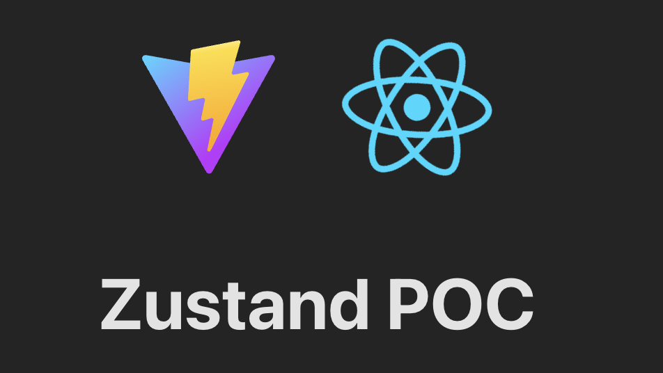
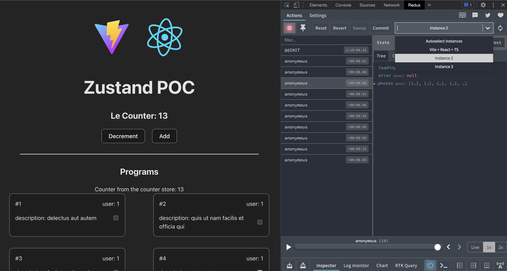

# Zustand Typescript POC



- Zustand official [docs](https://docs.pmnd.rs/)
- API from [JSONPlaceholder](https://jsonplaceholder.typicode.com/)
- YT zustand [tutorial](https://www.youtube.com/watch?v=jLcF0Az1nx8)
- YT zustand TS [tutorial](https://www.youtube.com/watch?v=dOJkaYE249I)

## Install

Install dependancies and start Vite

```
npm i & npm run dev
```

## Devtools

This project uses the [Zustand devtools middleware](https://docs.pmnd.rs/zustand/recipes/recipes#redux-devtools) based on Redux devtools.
To debug, install [Redux devtools extension](https://chrome.google.com/webstore/detail/redux-devtools/lmhkpmbekcpmknklioeibfkpmmfibljd?hl=en) and open extension, where each store will appear in its own instance.


